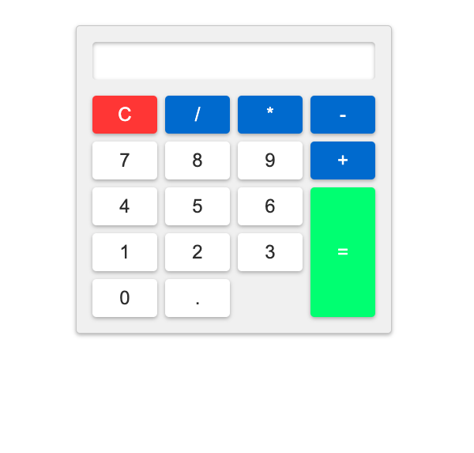

# Basic Calculator

## Description
This application is a calculator that computes basic arithmetic.

## Visual Presentation

## Links
[Calculator Github Repo](https://github.com/jessicashong/calc)

[Basic Calculator](https://jessicashong.github.io/calc/)